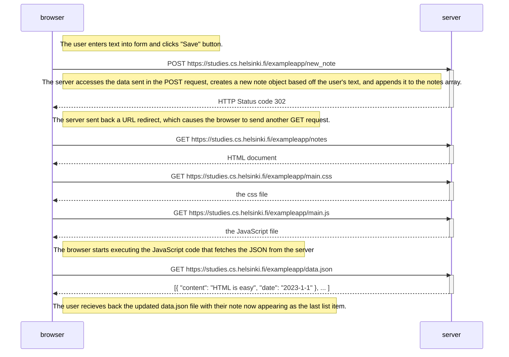

```mermaid
sequenceDiagram
participant browser
participant server

    Note right of browser: The user enters text into form and clicks "Save" button.
    browser->>server: POST https://studies.cs.helsinki.fi/exampleapp/new_note
    activate server
    Note left of server: The server accesses the data sent in the POST request, creates a new note object based off the user's text, and appends it to the notes array.
    server-->>browser: HTTP Status code 302
    deactivate server

    Note right of browser: The server sent back a URL redirect, which causes the browser to send another GET request.
    browser->>server: GET https://studies.cs.helsinki.fi/exampleapp/notes
    activate server
    server-->>browser: HTML document
    deactivate server

    browser->>server: GET https://studies.cs.helsinki.fi/exampleapp/main.css
    activate server
    server-->>browser: the css file
    deactivate server

    browser->>server: GET https://studies.cs.helsinki.fi/exampleapp/main.js
    activate server
    server-->>browser: the JavaScript file
    deactivate server

    Note right of browser: The browser starts executing the JavaScript code that fetches the JSON from the server

    browser->>server: GET https://studies.cs.helsinki.fi/exampleapp/data.json
    activate server
    server-->>browser: [{ "content": "HTML is easy", "date": "2023-1-1" }, ... ]
    deactivate server

    Note right of browser: The user recieves back the updated data.json file with their note now appearing as the last list item.


```
