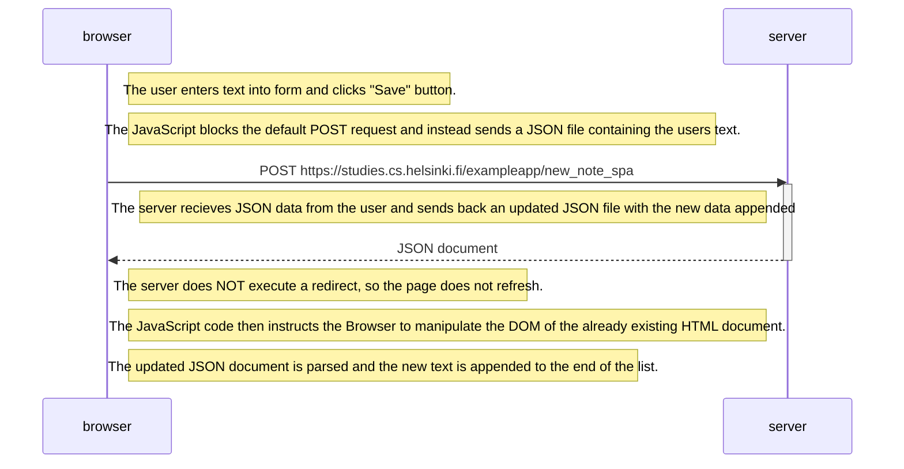

```mermaid
sequenceDiagram
participant browser
participant server

    Note right of browser: The user enters text into form and clicks "Save" button.
    Note right of browser: The JavaScript blocks the default POST request and instead sends a JSON file containing the users text.
    browser->>server: POST https://studies.cs.helsinki.fi/exampleapp/new_note_spa
    activate server
    Note left of server: The server recieves JSON data from the user and sends back an updated JSON file with the new data appended
    server-->>browser: JSON document
    deactivate server
    Note right of browser: The server does NOT execute a redirect, so the page does not refresh.
    Note right of browser: The JavaScript code then instructs the Browser to manipulate the DOM of the already existing HTML document.
    Note right of browser: The updated JSON document is parsed and the new text is appended to the end of the list.


```
